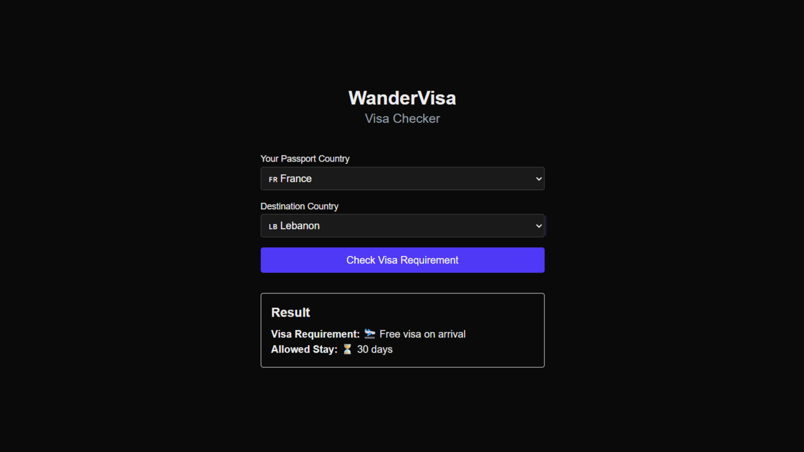

# **WanderVisa**

WanderVisa is a lightweight visa checker app that lets users quickly check visa requirements between countries. Built for travelers, digital nomads, and remote workers, it removes friction by delivering instant visa info with clean, minimal UI.

## **Features**

- **Instant Visa Lookups** – Select a passport country and destination to get visa requirements in seconds.
- **Emoji-Enhanced UX** – Visual indicators make results more intuitive and user-friendly.
- **Smart Wikipedia Scraping** – Up-to-date data sourced from official Wikipedia visa requirement pages.
- **Fast & Serverless** – No accounts, no lag; just fast answers.

## **Snapshots**

